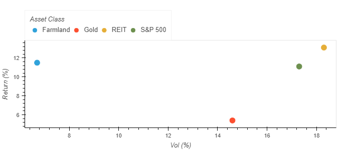
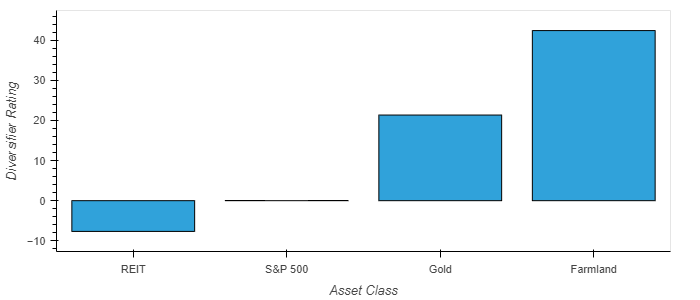
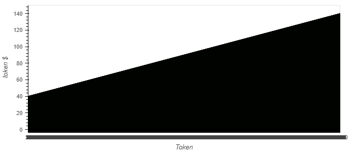
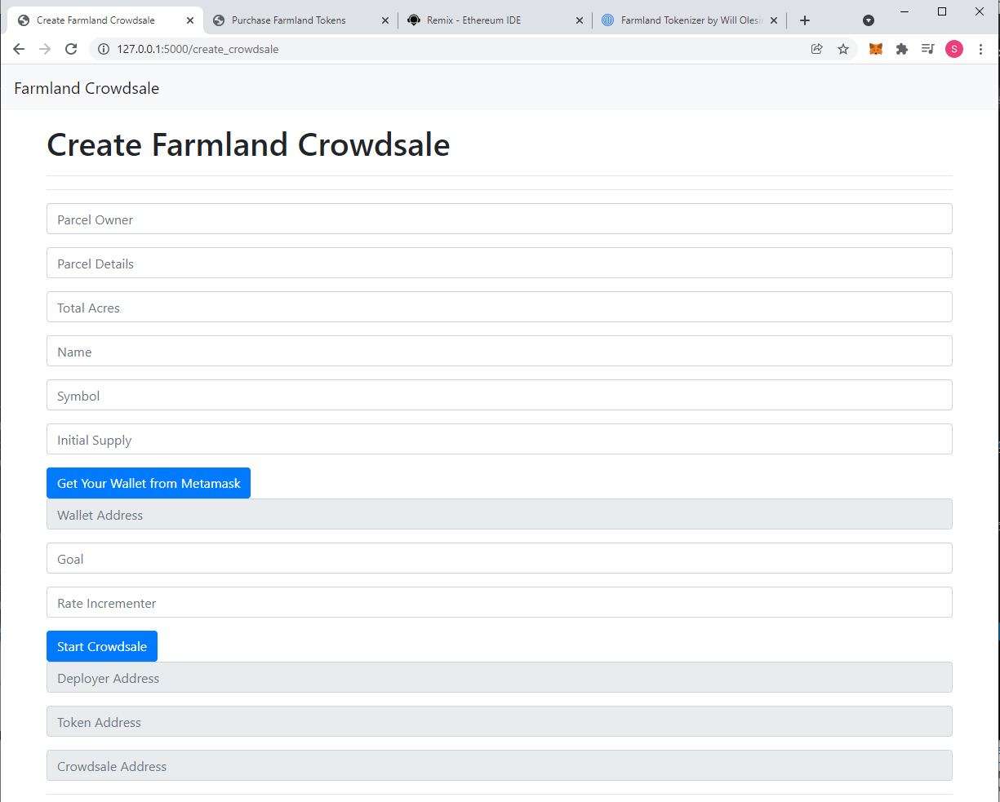
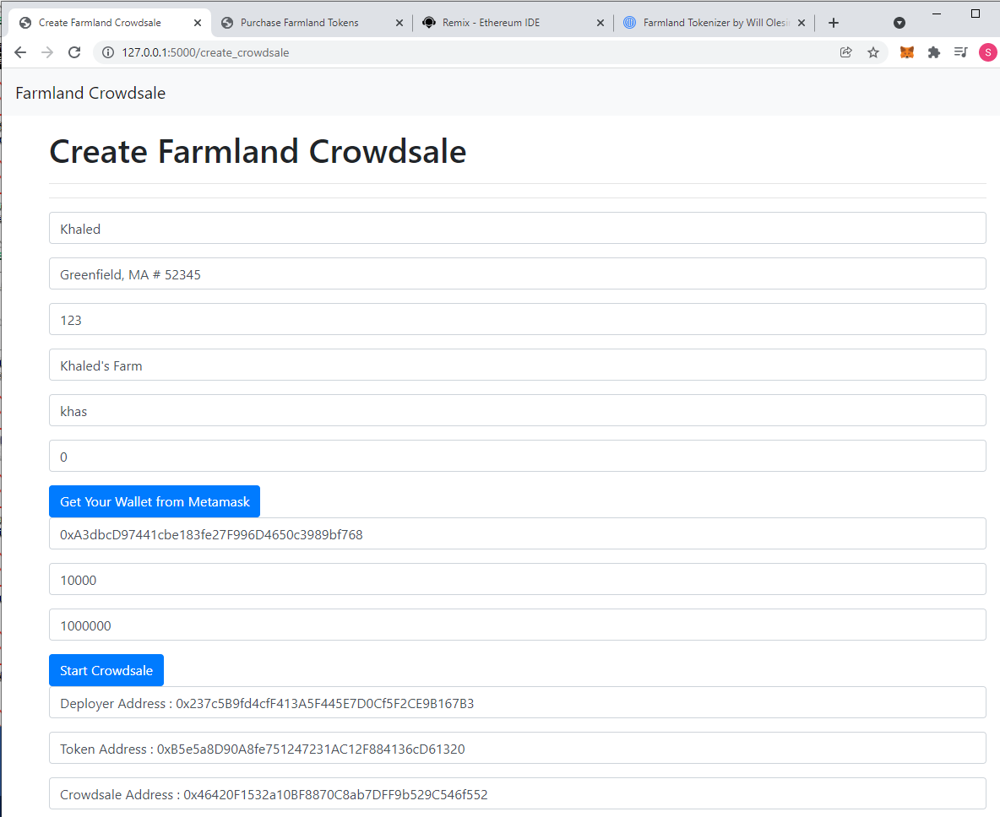
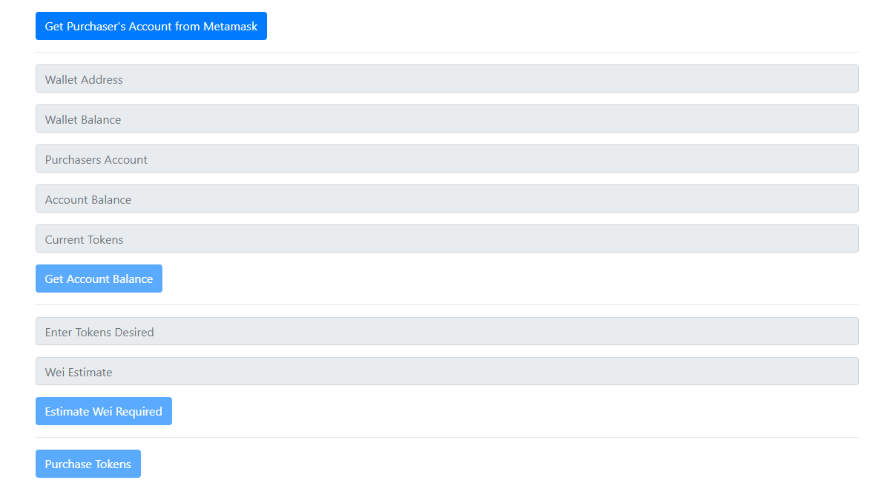
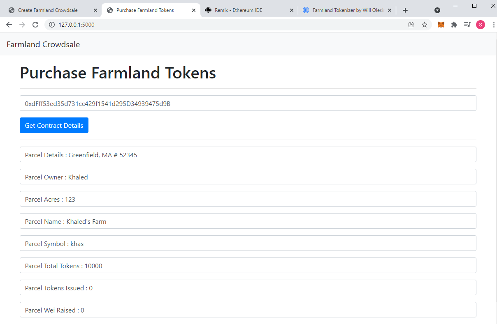

# Welcome to the Farmland Tokenizer
***
<a id="Top-of-Page"></a>

## <a id="Contents">Contents</a>
[Project Description](#Project-Description)<br>
[Technologies](#Technologies)<br>
[Installation guide](#Installation-guide) <br>
[Presentation](#Presentation)<br>
[Resources](#Resources)<br>
[Usage](#Usage)<br>
[Contributors](#Contributors)<br>
[License](#License)<br>
[Bottom of Page](#Bottom-of-Page)<br>

***
## <a id="Project-Description">Project Description</a>
# Farmland Tokenizer 
Background
<p> Owning a farm for retail investors can be very difficult, as can selling one. The Farmland Tokenizer will enable all parties to seamlessly transact ownership in farmland through our dApp, where a marketplace can exist based on supply and demand direct from retail investor to owner.
</p>

<p> Both stocks and the real estate market have seen unprecidented gains in recent years and with the recent injection of new money into the economy, concerns over inflation and increasing diversification in one's portfolio, have both gained interest in the minds of investors. The Farmland Tokenizer will allow for a hedge against inflation and create added diversification.
</p>

Motivation
<p> Agricultural land has long been considered to be one of the most secure forms of investment and similarly to gold, farmland is used by many investors as a natural hedge against inflation.
With the global population expected to reach 9 billion in 2040, the future outlook for land resources looks bright and a case for farmland investment comes down to two words: scarcity and necessity.
According to the US Department of Agriculture the average price of an acre of U.S. cropland has risen about 75% over the last 15 years (NY Times 2021). Moreover, according to Forbes(2021) farmland has delivered a higher average annual return than most asset classes in the last 29 years (1992-2020). 

To summarize in more detail, farmland has:
* (1) Historically Attractive Returns (1992 - 2020 / 11.01%)
* (2) Low Volatility of Returns (1992 - 2020 / 6.9%)

 Cumulative Returns of Major Asset Classes, Indexed to 1990
  


Farmland as a diversifier:
* Farmland has great returns with very low volatility
  

* Farmland has the best diversification ability when analyzed using return to downside volatility and/or return to maximum drawdown


Dynamic Pricing for Crowdsale:
* change the price per token (increase or decrease) based on demand.

Example:
* Price per token changes from $40 per token to $140 per token.
* Estimated conventional price of farm of $400K ends up earning $900K for the farmer because of the dynamic pricing




</p>

***
## <a id="Technologies">Technologies</a>
* [Python](https://docs.python.org/release/3.8.0/) - Python programming language
* [Pandas](https://pandas.pydata.org/docs/) - Data analysis and manipulation library.
* [Matplotlib](https://matplotlib.org/3.1.0/contents.html) - Matplotlib is a plotting library for the Python programming language
* [Prophet](https://facebook.github.io/prophet/docs/quick_start.html) - Prophet is a procedure for forecasting time series data
* [Tensorflow](https://www.tensorflow.org) - TensorFlow is an end-to-end open source platform for machine learning
* [Keras](https://keras.io/about/) - Keras is a Python interface for artificial neural networks
* [Streamlit](https://docs.streamlit.io/library/get-started) - Streamlit is an open-source app framework for Machine Learning and Data Science teams
* [JupyterLab](https://jupyterlab.readthedocs.io/en/stable/) - Web based user interface for data analysis.
* [Remix](https://remix.ethereum.org/) - Remix is a browser-based compiler and IDE that enables users to build Ethereum contracts with Solidity language and to debug transactions.
* [Solidity](https://docs.soliditylang.org/) - Solidity is an object-oriented, high-level language for implementing smart contracts. Smart contracts are programs which govern the behaviour of accounts within the Ethereum state.
* [MetaMask](https://metamask.io/) - A crypto wallet & gateway to blockchain apps.
* [Ganache](https://www.trufflesuite.com/ganache) - Quickly fire up a personal Ethereum blockchain which you can use to run tests, execute commands, and inspect state while controlling how the chain operates.
* [hvplot](https://hvplot.holoviz.org/) - hvPlot provides a high-level plotting API built on HoloViews that provides a general and consistent API for plotting data
* [Pandas](https://github.com/pandas-dev/pandas) - Data analysis and manipulation library.

***

## <a id="Installation guide">Installation guide</a>

The files containing the analysis of the farmland in the US and California leverage python 3.7 with the following libraries and dependencies:

``` python
pip install python-dotenv
pip install alpaca-trade-api
pip install matplotlib

```

In order to run the application you need to set up an Alpaca Markets account and obtain your personal API keys. You use these unique identifiers to establish an authenticated, secure connection to an API. For the security reasons you should store your unique API keys in a hidden file called .env This file protects the content of the file by hiding it in the structure of the project. To display hidden files in Jupyterlab run the following command in your terminal:

```python
jupyter lab --ContentsManager.allow_hidden=True
```

The project accesses the Alpaca API keys from the environment variables, and stores it in a Python variables named alpaca_api_key and alpaca_secret_api_key.

---
The analysis and price prediction of the Invesco DB Agriculture Fund "DBA" leverages python 3.7 with the following libraries and dependencies:

* Tensorflow - a free and open-source software library for machine learning and artificial intelligence. It can be used across a range of tasks but has a particular focus on training and inference of deep neural networks

* Keras - a popular deep learning framework that serves as a high-level API for TensorFlow. Keras is now included with TensorFlow 2.0

```python
pip install --upgrade tensorflow
```

Please install the following before starting the application

```python
  pip install jupyterlab
  pip install pandas
  pip install hvplot

```
In case of issues, please see the requirements.txt for a complete list of packages with versions needed to run this application

---

***
## <a id="Presentation">Presentation</a>
Presentation - https://prezi.com/p/u1tyqw1ucs9_/?present=1
[Presentation](https://prezi.com/p/u1tyqw1ucs9_/?present=1)

***
## <a id="Resources">Resources</a>
[1950 to 1994 Annual Price/Acre](https://www.ers.usda.gov/media/8648/sb738ab.xls)

[Average U.S. farm real estate value, nominal and real (inflation adjusted), 1970-2020](https://www.ers.usda.gov/webdocs/charts/55910/farmrealestatevalue2020_d.html?v=1175.2)

[USDA Agricultural Land Values](https://usda.library.cornell.edu/concern/publications/pn89d6567?locale=en#release-items)

[USDA Value of Land and Building Per Acre](https://www.nrcs.usda.gov/wps/portal/nrcs/detail/national/technical/econ/references/?cid=nrcs143_009723)
***
## <a id="Usage">Usage</a>

Flask - 
```python
  flask run
```

Default Create Crowdsale flask page -


Create Crowdsale flask page example - 


Default Purchase Token flask page - 



Purchase Token flask page example - 



Streamlit -
```python
  streamlit run farmland_token_app.py
```

***
## <a id="Contributors">Contributors</a>
* Ksenia Gorska 
* Kevin Mau 
* Sangram Singh - sangramsinghg@yahoo.com
* William Olesinski

***
## <a id="License">License</a>
This project was licensed under the MIT License. 


[Top of Page](#Top-of-Page)<br>
<a id="Bottom-of-Page"></a>
